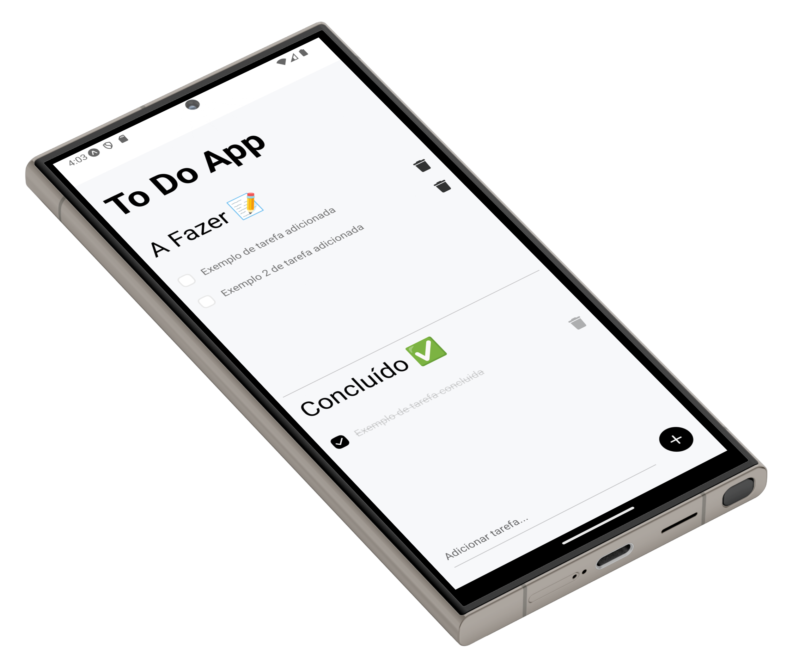

# To Do (React Native)

  

## About the Project

React Native To Do application created for learning purposes.

You can add tasks, delete them and mark as done.

### Built With

- Expo
- React Native
- Redux
- Redux Toolkit
- Redux Persist
- Husky
- Prettier
